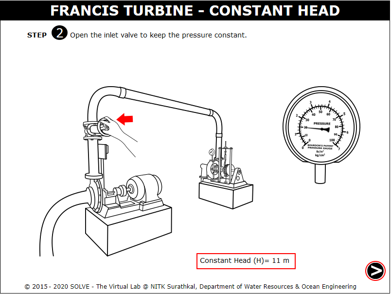

### These procedure steps will be followed on the simulator
#### Francis Turbine-Constant Head

1. Open the Francis Turbine- Constant Head experiment and click on the NEXT button shown at the bottom right corner and also description provided. 
 

2. Click on the green button to start the pump and select the head from the drop down menu,click NEXT button to proceed. 
 

3. Click on the hand to rotate the inlet valve and allow the water to flow, click NEXT button to proceed. 
 

4. Click on to add weight on the pan and calculate the Torque, click NEXT button to proceed. 
 

5. Click on to insert a Tachometer to note the speed of the motor 
 

6. Note down the speed and click NEXT button to proceed. 
 

7. Click on the hook gauge to note the readings, calculate the Actual Discharge,answer the question displayed and click NEXT button to proceed. 
 

8. Calculate the efficiency,unit power, unit speed, unit discharge with the help of formulas given, click NEXT button to proceed. 
 

9. Repeat the above steps for certain number of trials and click on the red button to stop the pump, click NEXT button to proceed. 
 

10. Click on each label button to see the different graphs plotted. 
 

#### Francis Turbine-Constant Speed

1. Open the Francis Turbine- Constant Speed experiment and click on the NEXT button shown at the bottom right corner and also description provided. 
 

2. Click on the green button to start the pump,click NEXT button to proceed. 
 

3. Select the constant speed to be taken from the drop down menu. Click OK. 
 

4. Click on the hand to add weight on the pan, calculate the torque and click NEXT button to proceed. 
 

5. Click on to insert a Tachometer to determine the speed of the motor. 
 

6. Note down the speed and click NEXT button to proceed. 
 

7. Note down the supply head reading and click NEXT button to proceed. 
 

8. Note down the vacuum head reading and calculate the Total Pressure click NEXT button to proceed. 
 

9. Click on the hook gauge to note the readings, calculate the Actual Discharge,click NEXT button to proceed. 
 

10. Calculate the efficiency with the help of formulas given, click NEXT button to proceed. 
 

11. Repeat the above steps for certain number of trials and click on the red button to stop the pump, click NEXT button to proceed. 
 

12. Click on each label button to see the different graphs plotted. 
 
