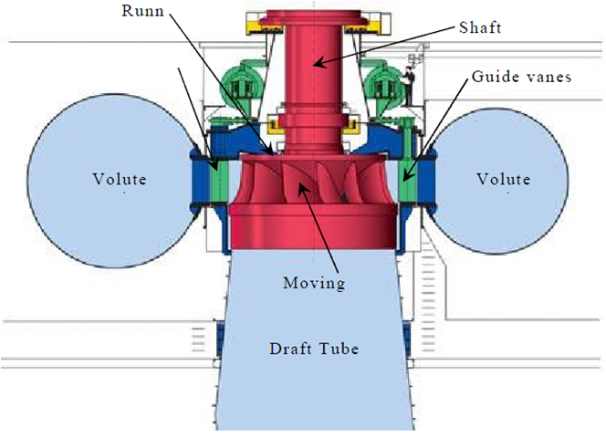
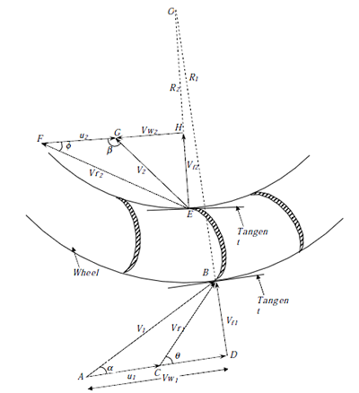
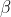
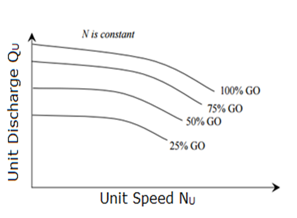
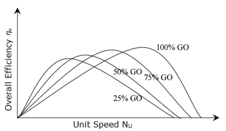

### INTRODUCTION 

The Francis turbine is a reaction turbine, in which the fluid changes pressure as it moves through the turbine, giving up its energy. The turbine is located between the high pressure water source and the low pressure water exit. The inlet of turbine is in spiral shape. The guide vanes direct the water tangentially to the turbine wheel which is known as a runner. This radial flow of water acts on the runner's vanes, causing the runner to spin. The guide vanes may be adjustable to allow efficient turbine operation for a range of water flow conditions. At the point of exit, the water leaves with no swirl and very little kinetic or potential energy. The shape of the turbine's exit tube helps to decelerate the flow of water and recover the pressure.

  

Sectional View of Francis Turbine
 

Source: (<a href="https://www.researchgate.net/figure/Basic-features-of-a-Francis-turbine-6_fig1_326934034">https://www.researchgate.net/figure/Basic-features-of-a-Francis-turbine-6_fig1_326934034</a>)

<h4 style="text-indent:50px;text-align:justify"><strong>Main parts</strong>:</h4>

  
1. <strong>Spiral casing</strong>: The runner is completely enclosed in an air-tight spiral casing. The casing and runner are always full of water. The water from the penstocks enters the casing in which area of cross-section of the casing goes on decreasing gradually. Since the casing is spiral shape, the water enters the runner at constant velocity throughout the circumference of the runner.

  
2. <strong>Guide vanes</strong>: The guide vanes allow the water to strike the vanes fixed on the runner without any shake at the inlet. Also by a suitable arrangement, the width between two adjacent vanes of a guide’s mechanism can be adjusted, so that the amount of water striking the runner can be varied.

  
3. <strong>Runner/Impeller</strong>: It is a circular wheel on which a series of radial curved vanes are fixed and the surface of the vanes is made very smooth. The radial curved vanes are so shaped that the water enters and leaves the runner without shock. The runners are made of cast steel, cast iron or stainless steel. The runner is connected to the shaft.

  
4. <strong>Draft tube</strong>: Draft tube is or pipe of gradually increasing area which is used for discharging the water from the turbine to the tail race. The pressure at the exit of the runner is generally less than atmosphere pressure. Hence the water is discharged to tail race through the draft tube.

  

Let,

= Radius of wheel at inlet of the vane

= Radius of wheel at outlet of the vane

= Angular speed of the wheel

Tangential speed of the vane at inlet = 

Tangential speed of the vane at outlet = 

The velocity triangles at inlet and outlet are drawn as shown in figure.  and  are the angles between the absolute velocities of jet and vane at inlet and outlet respectively.  and  are vane angles at inlet and outlet respectively.

The mass of water striking a series of vanes per second = 

where, a is the area of jet or flow and  is the velocity of flow at inlet.

The momentum of water striking a series of vanes per second at inlet is given by the product of mass of water striking per second and the component of velocity of flow at inlet = , where  is the velocity component of flow at inlet along tangential direction. Similarly momentum of water striking a series of vanes per second at outlet is given by , where  is the velocity component of flow at inlet along tangential direction and the -ve sign is because the velocity component is acting in the opposite direction. Now angular momentum per second at inlet is given by the product of momentum of water at inlet and its radial distance =  and angular momentum per second at inlet =−

Torque exerted by water on the wheel is given by impulse momentum theorem as the rate of change of angular momentum

Work done per second on the wheel = Torque x Angular velocity

=

=

=

As  and 

We can simplify the above equation as

In the above case, always the velocity of whirl at outlet is given by both magnitude and direction as

If the discharge is radial at outlet, then  and

Hence the equation reduces to,

Efficiency of the reaction turbine is given by,

Note: The value of the velocity of whirl at outlet is to be substituted as along with its sign.

=

Speed ratio = 

Where, H is the Head on turbine, it varies from 0.6 to 0.9.

Flow ratio=

Where,  is the velocity of flow at inlet, it varies from 0.15 to 0.3.

Discharge flowing through the reaction turbine is given by

Where,  and  are the diameter of the runner at inlet and outlet.  and  are the width of the runner at inlet and outlet.  and  velocity at inlet and outlet. If the thickness of the vane is to be considered, then

The area through which flow takes place is given by

Where, n is the number of vanes mounted on the runner.

Discharge flowing through the reaction turbine is given by

The head  on the turbine is given by

 and 

Hydraulic efficiency is

If the discharge at the exit is radial then ,

Hence hydraulic efficiency is

<h4 style="text-indent:50px;text-align:justify">Comparison of Francis turbine and Kaplan turbine</h4>

Francis Turbine |	Kaplan Turbine
:----:|:-----:|
Normal range of head:30-550m |	Normal range of head:1.5-80m
Number of vanes:15-25 |	Number of vanes:3-8
Specific speed:50-250 60-400 | Specific speed:300-1000
Cavitation susceptibility |	Greater cavitation susceptibility
Overall efficiency is good | Overall efficiency is better than Francis turbine
Requires large area |	Requires less area
Normal speed of runner:90-1000 | Normal speed of runner:70-600
Flow of water is radially and mixed flow type |	Flow of water is axial
Flow regulation is by guide vanes |	Flow regulation is by needle valve fitted into nozzle
Turbines works by medium discharge at average head |	Turbines works by high discharge low head

<h4 style="text-indent:50px;text-align:justify">Cavitation: </h4>

Cavitation is an effect mainly on the reaction turbine when water pressure drops below the critical pressure (generally vapour pressure) at constant temperature and vapour cavities are formed and grow based on the dynamic pressure reduction. Cavitation in hydraulic machines negatively affects their performance and may cause severe damages. Cavitation commonly occurs in hydraulic turbines, around runner exit and in the draft tube.

Cavitation is a phenomenon occurs when the static pressure of the liquid falls below its vapour pressure, the liquid boils and large number of small bubbles of vapours are formed. These bubbles mainly formed due to low pressure and carried by the stream to higher pressure zones where the vapours condense and the bubbles suddenly collapse, as the vapours are condensed to liquid again. This results in the formation of a cavity and the surrounding liquid rushes to fill it from all direction which collide at the centre of cavity giving rise to a very high local pressure whose magnitude may be as high as 7000 atm. Formation of cavity and high pressure are repeated many thousand times a second. This causes pitting on the metallic surface of runner blades or draft tube. The material then fails by fatigue, added by corrosion.

There are two ways to reduce the cavitation damage. One involves optimizing the hydraulic design of equipment and the other involves developing coatings for the substrates of wetted parts, which can prolong the overhaul interval of hydraulic components.

Cavitation in general is slow process but the effect of cavitation is severe. Damaged caused by cavitation, if summarized are: erosion of material from turbine parts, distortion of blade angle, loss of efficiency due to erosion/distortion (Santa JF et al, 2009) . Prof. D Thoma Suggested a dimensionless number called as Thoma's Cavitation factor σ (sigma), which can be used for determining the region where cavitation takes place in reaction turbines

Where,

 is the atmospheric pressure head in m of water

 is the suction pressure at outlet of reaction turbine in m of water or height of turbine runner above the tail water surface,

 is vapour pressure head,

 is the net head on the turbine in m of water

The value of  depends on (specific speed) of the turbine and for a turbine of given  the factor  can be reduced up-to a certain value up to which its efficiency,  remains constant. A further decrease in value of  can be reduced up-to a certain value up to which its efficiency,  remains constant. A further decrease in value of  results in a sharp fall in . The value of  at this turning point is called critical cavitation factor . The value of  for different turbines may be determined with the help of following empirical relationships:

For Francis Turbine:

The values of  from equation (1) is compared with the value of  from equation (2) and if value of  is greater than , cavitation will not occur in that turbine.

Francis Turbine Working Principle
 

Source: (<a href="https://www.ishwaranand.com/2020/09/francis-turbine.html">https://www.ishwaranand.com/2020/09/francis-turbine.html</a>)

<h4 style="text-indent:50px;text-align:justify">Performance characteristics of Francis Turbine: </h4>

Performance characteristics are of three types:

a. <strong>Constant head characteristics</strong>:

In order to obtain these curves the tests are performed on the turbine by maintaining a constant head and a constant gate opening and the speed is raised by changing the load on the turbine.

Constant Head Characteristics
 

Source: (<a href="http://mechanics4change.blogspot.com/2017/12/turbine-characteristic-curve.html">http://mechanics4change.blogspot.com/2017/12/turbine-characteristic-curve.html</a>)

 

b. <strong>Constant speed characteristics</strong>:

In order to obtain these curves the tests are performed on the turbine by operating them at constant speed.

 

Constant Speed Characteristics
 

Source: (<a href="http://mechanics4change.blogspot.com/2017/12/turbine-characteristic-curve.html">http://mechanics4change.blogspot.com/2017/12/turbine-characteristic-curve.html</a>)

 

c. <strong>Constant efficiency curves</strong>:

These curves show the efficiency of the turbine for all conditions of running and hence these are also known as universal characteristic curves.

Constant Speed Characteristics
 

Source: (<a href="https://www.researchgate.net/figure/Efficiency-hill-chart-of-existing-turbine-Q-11opt-073-N-11opt-65-and-opt-92_fig7_245356930">https://www.researchgate.net/figure/Efficiency-hill-chart-of-existing-turbine-Q-11opt-073-N-11opt-65-and-opt-92_fig7_245356930</a>)

